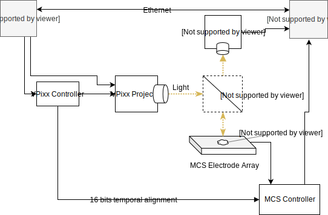

System Blueprint
================

The goal of the system is to optically stimulate brain tissue with temporal-spatial precision and to
simultaneously record the voltage of the neurons in the tissue being stimulated with a dense
electrode array (e.g. 256 electrodes).

The overall system looks as follows

Ceed
----

In the diagram, Ceed is the software responsible for the spatial temporal stimulation.
Users create spatial patterns in ceed, and associate temporal functions with the shapes.
E.g. we may want to stimulate a single neuron with a sine wave, so we draw a circle around
it and vary the circle's intensity temporally using a sine function.

Ceed uses Python 3 and Kivy for the GUI. We have a dedicated Ubuntu 18 computer that runs
the software.

VPixx
-----

To stimulate the tissue, we use a VPixx projector, that can output frames upto 1440 Hz in
greyscale or 500 Hz in RGB. Ceed generates the frames, which is sent to the projector,
and then through a lenses until it reaches the tissue.

Multichannel Systems (MCS)
--------------------------

The MCS system is the electrode recording system and is responsible for
recording any brain activity in the tissue. This is a dense electrode array recording from
many cells simultaneously.

This system is controlled by MCS provided software that controls the electrode arrays
and records the electrode data to files.

Camera
------

We use a Thor camera to capture light emitted by the tissue. In a typical experiment,
first we broadly stimulate the tissue with light to see where the cells are present
as captured by the camera. Then, we design stimulus in Ceed to stimulate the desired cells
and observe the resulting electrical activity.

Data alignment
--------------

To temporally align the light stimulation data with the electrode recording system,
Ceed uses a single pixel in each frame to provide a temporal pattern of upto 16-bit
in each frame (there's 24 bits available in a single pixel - RGB). VPixx doesn't
display this pixel, but instead sends it as a digital output
on its controller for each frame. This signal is physically patched to the MCS system and is
used for precise alignment between the stimulation and electrode recording system after
the experiment.

Networked PCs
-------------

Because the linux PC is used to generate the Ceed frames which is output to the projector,
we cannot use that computer to view the camera images. When we tried attaching multiple
screens, the GPU periodically missed frames, we suspect because the the two screens may not
have supported the precise frame rate. Consequently, we use the Windows computer running
the MCS software to control the Thor camera, display the images to the user and then
pass them over the network to the Linux/Ceed PC.
