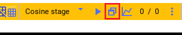
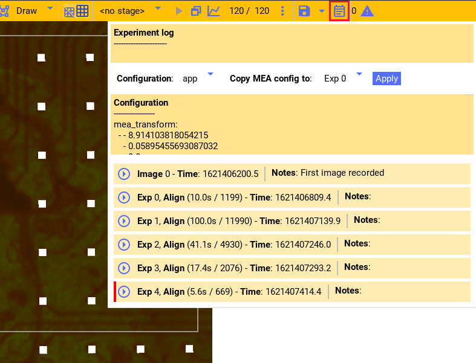
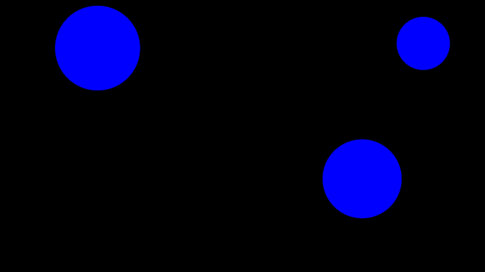

Ceed experiment
===============

See the :ref:`experiment control API <view-api>` for in-depth experiment control details.

.. _run-experiment:

Running experiment
------------------

Any of the stages created in the stages pane can be :ref:`run as an experiment <view-api>`.
As shown in the :ref:`stage guide <stage-guide>`, a stage

1. can be previewed as an intensity vs. time plot for each shape. See :ref:`preview-stage`.
2. It can be previewed by playing the experiment in the drawing area. See :ref:`preview-play-stage`.
3. Or the experiment can be played as a real experiment by opening the second
   Ceed window and playing the experiment.

To run a real experiment, select the stage to use from the dropdown menu and press the
window button. This will open a second blank Window that is fullscreen.
The experiment will play in that screen when the stage is started with the keyboard.

Following are the keyboard shortcuts used to to interact with Ceed from that window:

* ``ctrl-s`` starts an experiment using the currently selected stage.
* ``ctrl-c`` stops the currently running experiment.
* ``ctrl-z`` stops the currently running experiment (if any) and closes the fullscreen window.
* ``ctrl-f`` toggles the second window between fullscreen and normal.

The fraction (0 / 0 in the image) is the estimated experiment CPU and GPU refresh rate for
Ceed, respectively.

.. _experiment-data:

Experiment data
^^^^^^^^^^^^^^^

Ceed saves all the experiment data into a `Nix <https://nixpy.readthedocs.io/en/latest/>`_
data file. Each experiment (even when previewed-played) creates a new unique section
in the Nix H5 data file and Ceed stores all the experiment data there.

Before running the experiment, Ceed copies the stage to be used for the experiment
and creates a new stage called ``experiment_sampled``
(:py:attr:`~ceed.stage.last_experiment_stage_name`) from it (overwriting the
last one, if present). This is the stage Ceed actually runs. Then, Ceed saves the
current camera image, if any, and the complete :ref:`Ceed configuration <tut-config>`
including the stages/shapes/functions required to reproduce the experiment.

During the experiment it saves for every frame the red,
green, and blue intensity values for every rendered shape. It also saves the frame time
and frame digital IO pattern that is sent along the ProPixx to MCS hardware connection
so we can temporally align the Ceed frames to the MCS electrode data post hoc.

Additionally, each experiment is added to the image/experiment log window. It displays
the camera image, if any, and it allows you to enter notes for the experiment that is
available during :ref:`analysis <analyze-tut>`.

Ceed automatically creates an anonymous Nix file when Ceed starts. Experiment data is
saved there. When the file is explicitly saved to a location (see :ref:`tut-config`)
the data is copied and saved there. But, Ceed maintains the internal anonymous file
to which it writes future data and copies it to the requested file when explicitly
saved by the user. Consequently, unsaved data can safely be discarded without affecting
the user data file. Ceed will prompt you when closing Ceed while there's data in the
Ceed file that has not been explicitly saved.

Spatial system alignment
------------------------

There are three physical systems that interact with a tissue slice:

1. The MEA it rests on. There's an electrode grid beneath the tissue and the tissue
   orientation determines on which electrodes it rests on.
2. The projector. The projector, through the lenses, projects light patterns on the
   tissue; again the orientation determines how the tissue is stimulated.
3. The camera. The camera observes the slice, the projector patterns, and potentially
   the electrode grid.

There are two spatial alignment procedures, described below, that enables us to know
precisely where on the tissue the projector stimulated and which electrodes are
beneath it.

The first computes the transformation matrix between the camera and projector
(:py:attr:`~ceed.view.controller.ViewControllerBase.cam_transform`),
the second between the camera and the MEA electrode termination
points (:py:attr:`~ceed.view.controller.ViewControllerBase.mea_transform`).
Together, we can compute the transformation matrix between
any of three physical systems. These matrices are stored with the rest of the
:ref:`Ceed configuration <tut-config>` and saved with experiments and is available
during analysis.

.. _align-cam-proj:

Aligning camera to projector
^^^^^^^^^^^^^^^^^^^^^^^^^^^^

This procedure aligns the camera and the projector so given the camera image we can know
precisely where on the image each projector pixel will project on. This must be done
anytime the camera or the projector or any of the lenses in its path are moved.

First draw a few unique shapes that will allows us to clearly identify any rotations
and translations of the shapes. Then add a constant function that stimulates these shapes
at some large intensity for an extended duration.

Following is an screenshot and configuration file for an example stage.

.. image:: ../media/guide/align_cam_before.png

:download:`Ceed camera alignment config <../media/guide/align_cam.yml>`

Now ensure that Filers2 is streaming camera images to Ceed and run the experiment
in the fullscreen window on **an empty array**.

For the example stage, we would see the following being projected on the tissue
and on screen. Notice that the projector output is flipped; it's set in the settings
window (see :ref:`tut-config-window`, "reflect shapes horizontally") because the
lenses flip the projection in the current setup (2021).

While it's running observe the camera output in Filers2 on the other computer.
The camera (and you) should see the shapes being projected on the array like the image.
You can stop the experiment (ctrl-c) when it's clear in the camera. When done, in Ceed
stop the camera from streaming and reload the camera image to the
image just before the stage ended (see :ref:`reload-last`).

Now, as in the video below, enter "align cam" mode and using the mouse apply scaling,
rotation, and translation to the image on the shapes and image align. Use right mouse
click to add the red dot to allow scaling and rotating relative to it. If the shapes
appear mirrored, enable "reflect camera horizontally" in the settings window
(see :ref:`tut-config-window`).

.. video:: ../media/guide/stage_create.webm

.. _align-cam-mea:

Aligning MEA to camera
^^^^^^^^^^^^^^^^^^^^^^

This procedure aligns the camera and the MEA so given the camera image we can know
precisely where on the image each electrode terminates. This must be done
anytime the MEA is translated or rotated (likely after each experiment).

First ensure that Filers2 is running the camera and streaming it to Ceed. Within
Ceed similarly stream the images from Filers2. Now, turn ON the lamp beneath the
MEA until the array is clearly seen in the images, like below. Adjust the exposure
etc in Filers2 if it's too bright/dark.

Like above, enter "Align_MEA" mode and using the mouse apply scaling,
rotation, and translation to the grid until it aligns with the electrodes
termination points. Notice in the video that electrode A12, as visible on the
array, is in the top left corner.

If the number of electrodes in the columns/rows don't match or the electrodes
need to be flipped, you can change them in the configuration file (see
:ref:`tut-config`, and properties
:py:attr:`~ceed.view.controller.ViewControllerBase.mea_diameter`,
:py:attr:`~ceed.view.controller.ViewControllerBase.mea_num_cols`,
:py:attr:`~ceed.view.controller.ViewControllerBase.mea_num_rows`,
:py:attr:`~ceed.view.controller.ViewControllerBase.mea_pitch`,
:py:attr:`~ceed.view.controller.ViewControllerBase.mirror_mea`,).

.. video:: ../media/guide/align_mea.webm

Typically at the start of an experiment you may move the array, e.g. to adjust to
the tissue. So you would need to do the alignment after the experiment to know the
transformation used during the experiment. Unfortunately, the experiment data would
already include the incorrect matrix saved at the start of the experiment.

Ceed lets you back-apply the MEA transformation matrix to existing experiment data
as shown in the following video. The red bar indicates that the transform
is different than the subsequent experiment (or current value for last experiment) -
meaning that it changed.
At the top you can copy the transform from any experiment to another, where app means
the current Ceed app value. In the video we copy the current transform to experiments
1-4 (with the assumption that the current transform applies to all these experiments).

.. video:: ../media/guide/align_mea_apply.webm

Experiment flow
---------------

Given the above, an overall typical experiment flow is as follows:

#. Initially do :ref:`align-cam-proj`.
#. Create a shape that encloses the entire projector area (see :ref:`control-shape`).
   Add stage with a constant function to stimulate it. Ensure the camera is streaming and
   run that stage. You should now see area of the tissue that fluoresces due to cells.
#. Design a stage for your experiment.
#. :ref:`Run <run-experiment>` that experiment.
#. :ref:`Align the MEA to camera <align-cam-mea>` for that tissue.
#. Using the Ceed code, :ref:`merge <merge-tut>` and align the Ceed and MCS data
   files into a single Ceed file.
#. Using the Ceed code, :ref:`analyze <analyze-tut>` the recorded experiment data.

Projection Frame rate
---------------------

By default the projector refreshes and re-renders the stimulation shapes at 120Hz
(119.96 more precisely). The rate must be correctly set in the settings window
to the exact decimal to match the GPU refresh rate, and it must show the correct
fraction. Otherwise the experiment will be OFF temporally. You can see the
refresh rate for your GPU by inspecting e.g. the NVIDIA control panel.

At 120Hz it is too slow if we need to stimulate at e.g. 100Hz. E.g. a sine wave
would barely have one sample per cycle. The projector can be refreshed at higher
rates, at a cost of lower resolution or color. From the settings you can select
these faster video modes. There are three options:

1. RGB, the normal mode that refreshes at 120Hz.
2. QUAD4X, a mode that updates at 4 * 120Hz at the cost of only having a quarter
   of the resolution.
3. QUAD12X, a mode that updates at 12 * 120Hz at the cost of only having a quarter
   of the resolution and only being able to project one intensity value for the red,
   green, and blue channels (i.e. grayscale - you can still turn OFF specific LEDs
   though, see :ref:`led-tut`).

The mode can be selected from the settings window (see :ref:`tut-config-window`).
E.g. here we selected QUAD12X for the video mode. This results in a refresh rate
of 1,439.52Hz.

.. image:: ../media/guide/settings_window_mode.png

When using the quad mode, the projector internally re-uses the quadrants of the
video frame for this increase in speed. So on the monitor it would seem like
the 4 quadrants are displaying separate frames (see image below), the projector
correctly outputs only one quadrant at a time.

.. image:: ../media/guide/quad_mode.png

.. _led-tut:

Projector LEDs
--------------

The projector contains three internal LEDs - red, green, and blue that allows
rendering any color using a combination of these LEDs. Typically you specify in
Ceed the color to use for each stage (e.g. red and green, see :ref:`stage-color`)
and an intensity for each video frame from the functions. Then the projector
will automatically control the LEDs to output the requested color.

The projector LEDs can also be directly turned ON or OFF individually. In the
settings window (see :ref:`tut-config-window`) you can select any of the
red, green, and/or blue LEDs to be ON or OFF independently.

There are two options:

1. **Projector LED mode**
   (:py:attr:`~ceed.view.controller.ViewControllerBase.LED_mode`).
   This controls which LED is available when running the
   experiments. Any of the turned OFF LEDs will not respond if Ceed sets that color
   (e.g. setting it to ``"RG"``, will disable the blue LED).
2. **Projector LED mode (idle)**
   (:py:attr:`~ceed.view.controller.ViewControllerBase.LED_mode_idle`).
   Like the first, but it controls the LEDs outside an
   experiment. Outside the experiment they should be OFF (i.e. set option to none)
   because otherwise the projector would be projecting on the slice the whole time.
   Setting it to none turns OFF all the LEDs. Ceed will automatically switch to
   the first mode option when the experiment starts and then switch back when done.

In QUAD12X mode, Ceed will set the color to grayscale because red, green, and blue
are assigned the same intensity value. However, you probably only want to stimulate
a specific color (e.g. blue). Manually turn OFF the other LEDs in that case and even
though Ceed will request to stimulate all three LEDs (gray), the projector will only
use the blue LED.

.. _tut-config:

Ceed configuration
------------------

Ceed is fully configured from a yaml configuration file. The settings in the file
are documented in the auto generated
`configuration docs <https://matham.github.io/ceed/config.html>`_. The default
yaml file loaded by Ceed is contained where Ceed is installed, under
``ceed/data/CeedApp_config.yaml``. The file can be edited or deleted
altogether (and Ceed will recreate it), while Ceed is closed.

In addition to the app settings in the file, Ceed can also include all the
stages, shapes, and functions in the yaml configuration. Ceed relies on the
ability to encode the stages and other required metadata to yaml in order
to run the experiment cleanly in the full-screen window. So all plugins
must ensure that their objects can be fully captured by config.

The config can be expressly saved or imported from the data window:

.. image:: ../media/guide/data_window.png

From the data window you can either import/export/open/save the config
and experiment data to the Nix H5 file, or you can import/export the config
to a yaml file as detailed below.

Yaml file
^^^^^^^^^

Ceed can export the stages/shapes/function to a yaml file to be re-used as
a template later for a new experiment. To use it, import the stages yaml file.

In addition to the stages, it can also export and import the overall app settings
from the yaml file (e.g. the frame rate, camera and MEA transforms etc).
Importing **only the stages** is recommended because it may not be visibly obvious
all the configuration options that changed when importing the app settings.

Following is an example config file with just the stage/shape/functions
settings as well as one with the app settings as well:

:download:`Stages config <../media/guide/stages_config.yml>`
:download:`Stages and app settings config <../media/guide/stages_with_app_settings_config.yml>`

H5 file
^^^^^^^

Ceed uses Nix H5 files to store the experiment data. However, it also stores a
complete copy of the current app settings and stages/shapes/functions whenever
it is saved. In addition, the complete settings are also saved for each
experiment with the experiment data.

Like with the yaml file, you can import the last configuration from the H5
file. But, you can also explicitly save or re-open the H5 file.

You can save and save-as the H5 file (including from the save icon). Until
saved, the changes are saved to a temp file and only copied to the indicated
H5 file every time manually saved. You can also discard unsaved changes or close
the H5 file altogether. And you can open existing H5 files, which loads
their last config into Ceed.

.. _tut-config-window:

Configuration window
^^^^^^^^^^^^^^^^^^^^

Although most settings can only be changed from the yaml file, a few settings are
exposed in the settings window:

.. image:: ../media/guide/settings_window.png

Following is an overview of the settings not explained in previous/subsequent sections.
Each settings also has an associated property in the yaml file and documented
in the `configuration docs <https://matham.github.io/ceed/config.html>`_.

* "Projector window is fullscreen": See
  :py:attr:`~ceed.view.controller.ViewControllerBase.fullscreen` in the config docs.
  This should be True.
* "Restrict projector play rate": See
  :py:attr:`~ceed.view.controller.ViewControllerBase.use_software_frame_rate`
  in the config docs. This should be False expect perhaps during testing.
* "File compression": See
  :py:attr:`~ceed.storage.controller.CeedDataWriterBase.compression`` in the config docs.
* "Pad stage duration to handshake": See
  :py:attr:`~ceed.view.controller.ViewControllerBase.pad_to_stage_handshake`
  in the config docs. This should ideally be True, otherwise merging Ceed with MCS
  data may not work.
* "Pre-compute finite stages/functions": See :ref:`pre-compute` and
  :py:attr:`~ceed.view.controller.ViewControllerBase.pre_compute_stages` in the config docs.
  This should ideally be True, especially if stage functions do much computation, because
  otherwise Ceed would do too much work during the experiment, potentially missing
  frames. By pre-computing, all the computation is done before the experiment starts.

  .. note::

      If turned ON, there will be a slight delay (potentially many seconds) between
      starting an experiment and the experiment actually starting.

.. _teensy-tut:

Teensy uC
---------

The CPU/GPU will sometimes take more than a frame duration to display a frame.
E.g. if the computer is processing too much, it may not submit the next frame in
time. Consequently, Ceed needs to :ref:`drop a frame <dropped-frames>` to
compensate for the slow frame.

Ceed can detect delayed frames using a software-based time estimation (
:py:class:`~ceed.view.controller.FrameEstimation`), or using
a connected Teensy microcontroller (
:py:class:`~ceed.view.controller.TeensyFrameEstimation`). The Teensy,
by watching the Ceed to MCS hardware
link, can notify Ceed more quickly and reliably than the software approach.

Whether to use the Teensy is set in the settings window (see "Use Teensy" -
:ref:`tut-config-window`,
:py:attr:`~ceed.view.controller.TeensyFrameEstimation.use_teensy`).
The Teensy can only be used when the GPU is updating
at 119.96Hz (it's hardcoded in the Teensy's firmware).

The Teensy also has an LED that blinks faster when the experiment starts,
while it's pre-computing the stages (see above) and getting things ready.
It blinks even faster while the experiment is running. This LED can help
you track the current experiment state during an experiment.

Post experiment Analysis
------------------------

.. _merge-tut:

Merge data
^^^^^^^^^^

After experiments you'll have two files:

1. The Ceed H5 :ref:`data file <experiment-data>` containing the intensity
   values for every shape and for every frame, for each experiment stored in
   the file.
2. A MCS proprietary file containing all the electrode data recorded during the
   experiments. The MCS data tool allows you to export this data into an HDF5
   (H5) file.

The merging step merges both files and computes the temporal alignment between
them so we know exactly which electrode samples correlate with each projected frame.

It outputs a Ceed based Nix H5 file that contains the Ceed experiment data, the
electrode data, and the alignment between them for all experiments.

See :ref:`merge-api` and :ref:`merge-api-example` for the merging API. See also
:ref:`merge-example` for a completely worked example.

.. _analyze-tut:

Analyze data
^^^^^^^^^^^^

After :ref:`merging <merge-tut>` the Ceed and MCS data into a single Ceed file,
you can use the :py:class:`~ceed.analysis.CeedDataReader` to load the data
and the experiment Ceed configuration.

See :ref:`ceed-analysis` for the API. See also
:ref:`example-analysis` for completely worked through examples of reading
and using the data.

Some data relevant :py:class:`~ceed.analysis.CeedDataReader` properties are
:py:attr:`~ceed.analysis.CeedDataReader.electrodes_data`,
:py:attr:`~ceed.analysis.CeedDataReader.electrode_intensity_alignment`,
:py:attr:`~ceed.analysis.CeedDataReader.shapes_intensity`,
:py:attr:`~ceed.analysis.CeedDataReader.shapes_intensity_rendered`, but see
the examples and the other class properties for full details.

For example, Ceed can generate a video replaying the stage and the electrodes'
voltage corresponding to the stage frames. The following video shows the voltage
of each of the electrodes in the array, and it replays the stage stimulation
protocol. It is replayed on a image of the tissue. Additionally, a rectangle
shows the electrodes the tissue falls on. I.e. the top right corner of the tissue
corresponds to the A1 electrode. Meaning the array is rotated approximately
90 degrees clockwise.

.. video:: ../media/guide/analysis_video.webm
