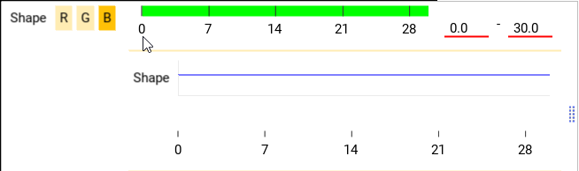
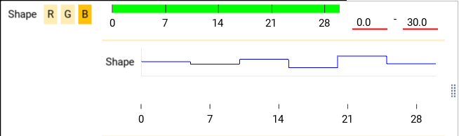

Ceed functions
==============

A Ceed :ref:`function <function-api>` is how a stage attaches a time-varying intensity
to its shapes.

The stage calls the function or sequence of functions for every video frame with
the current global time and the function returns a scalar value between 0-1, inclusive.
This intensity is used for that stage's shapes for that frame.

See the :ref:`function API <function-api>` for in-depth function details.

Creating functions
------------------

Ceed comes with :ref:`pre-defined <function-factory-plugin>` functions, but a
:ref:`plugin <func-plugin>` can add to the available functions.
Additionally, you can customize functions in the function pane to make it available for
re-use in other function groups or stages.

This video shows multiple ways to create a customized global cosine function from
existing cosine functions.

.. video:: ../media/guide/function_creating.webm

Customizing functions
---------------------

Each function has parameters that describe its output as a function of time. All
functions have these basic parameters:

#. **Duration** (:py:attr:`~ceed.function.FuncBase.duration`) - the time
   :ref:`domain where it's valid. <func-domain>`. See also :ref:`func-precision`.
#. **Loop** (:py:attr:`~ceed.function.FuncBase.loop`) - the number of times to loop.
   The function restarts as many times over its domain until done.
#. **TB num/denom** (:py:attr:`~ceed.function.FuncBase.timebase`) see :ref:`func-precision`.
#. **Offset** (:py:attr:`~ceed.function.CeedFunc.t_offset`) - an offset to the time
   parameter. E.g. if the function is ``y = m * t + b``, specifying a non-zero value
   for offset will compute ``y = m * (t + t_offset) + b``.

.. video:: ../media/guide/function_customize.webm

.. _func-group-tut:

Function groups
---------------

Functions groups enable iterating through a sequence of functions as if it was a single
function whose duration is the sum of its children functions, recursively.

Initially, when adding or dragging a global function into a group, only a reference to
the function is added. So changing the original function will change the reference
function as well, and the original function cannot be deleted. A reference function is
indicated with the T-junction icon in the video. Clicking it will break the reference
and convert it to a independent function.

Ceed guards from adding a group function to itself or its children, to prevent
infinite recursion as shown at the end of video.

.. video:: ../media/guide/function_group.webm

Randomizing functions
---------------------

Function parameters can be :ref:`randomized <func-random-param>` so it is resampled before
each experiment. As seen in the video, there are multiple distributions to choose from
and more can be added by :ref:`plugins. <func-plugin>`

.. video:: ../media/guide/function_random.webm

Looping
^^^^^^^

When a function or :ref:`stage <mod-stage>` is looped, randomized parameters can be
resampled once and the value used for all loop iterations, or it can be resampled
once for each loop iteration.

In Ceed, the "Resample each loop"
(:py:attr:`~ceed.function.param_noise.NoiseBase.sample_each_loop`) option controls
this behavior. For example, this protocol contains a function of constant intensity
of 5 sec duration. Additionally, the function loops twice and the stage loops 3 times
for a total of 6 loops. The intensity parameter is randomized from a Gaussian and
is not resampled for each loop. So its :ref:`graph <preview-stage>` is constant.

:download:`Ceed config <../media/guide/function_random.yml>`

This protocol however does resample each loop iteration, which is reflected in its
graph.

:download:`Ceed config <../media/guide/function_random_per_loop.yml>`

Lock after forking
^^^^^^^^^^^^^^^^^^

Before an experiment, functions with random parameters are re-sampled and then
copied; that's so the original prototype functions are not directly used by an
experiment. After the copy, Ceed again re-samples the functions because of the
following.

As shown :ref:`above <func-group-tut>`, Ceed supports reference functions that can
be re-used in multiple places, allowing them to share parameters. These references
are individually cloned from the prototype at the copying step into unique functions.
The randomized parameters of the cloned functions support two options with regards to
re-sampling, controlled by "Lock after fork"
(:py:attr:`~ceed.function.param_noise.NoiseBase.lock_after_forked`).

If **False**, Ceed will resample the parameter again after cloning. This ensures that
each cloned copy will not share the same random values as the original and sibling
functions. If **True**, the cloned functions will not be re-sampled so they will
share the original re-sampled parameters.

The following protocol contains 3 functions; a reference to a constant function that
loops 5 times and its intensity is randomized, it's followed by a short cosine, that is
followed again by a reference to the same constant function.

Here we set "Lock after fork" to False. You can see how both references to the
constant function have different values.

.. image:: ../media/guide/function_random_fork.png
:download:`Ceed config <../media/guide/function_random_fork.yml>`

Here we set "Lock after fork" to True. You can see how both reference functions
repeat the same pattern because they share the same random values for each loop
iteration.

.. image:: ../media/guide/function_random_fork_lock.png
:download:`Ceed config <../media/guide/function_random_fork_lock.yml>`

.. _func-precision:

Function timebase
-----------------

Functions are sampled by the stage at integer multiples of the video frame rate period.
As function :py:attr:`~ceed.function.FuncBase.duration` approaches the period,
specifying duration using time in decimal
leads to inaccuracy and rounding. Functions therefore support specifying duration as
integer multiple of video frames. E.g. it can be set to be exactly one frame long.

When the function :ref:`timebase <func-timebase>` is specified and non-zero, the duration
is multiplied by the :py:attr:`~ceed.function.FuncBase.timebase` to get the duration
in seconds. So when the timebase is exactly one over the frame rate - the period,
a duration of one means one frame.

E.g. in the video, the frame rate is 59.94, or 2997 / 50. Setting the timebase fraction
to 50 / 2997 will allow use to set the duration of each constant function in the group
to one frame. Then, setting the intensity (``a``) of the first child function to zero,
the second one to one, and the group to loop over them 500 times will create a
function that alternates between zero and one intensity for each frame.

The stages and preview graph are explained in the :ref:`stage guide <stage-guide>`.

.. video:: ../media/guide/function_precision.webm

:download:`Ceed config of the video <../media/guide/function_precision.yml>`

Children of function groups (recursively) inherit their timebase from their parents,
if it's not explicitly overwritten by the child.

Function plugin
---------------

Ceed comes with a few functions, however using :ref:`plugins <func-plugin>`
Ceed can support any custom function.

It is fully explained in :ref:`func-plugin`, but you can make your plugin available to
Ceed by copying your Python file to the ``ceed/function/plugin`` directory
under where Ceed is installed, or register your external plugin package
using :py:attr:`~ceed.main.CeedApp.external_function_plugin_package`.

Ceed gets your function classes using a ``get_ceed_functions`` function in the
plugin and similarly it uses ``get_ceed_distributions`` to get the probability
distribution classes.

To write a plugin, it helps to become familiar with the
:ref:`function API <function-api>` and the :py:class:`~ceed.function.FuncBase`
class that all functions inherit from.

A very simple function plugin file that computes ``1 / (max(t, 1) ^ 2)``,
where ``t`` is the elapsed time is:

.. code-block:: python

    from kivy.properties import NumericProperty
    from ceed.function import CeedFunc

    class DecayFunc(CeedFunc):

        # The parameter must be a Kivy property, so the GUI can update from it
        c = NumericProperty(1.)

        def __init__(self, **kwargs):
            self.name = 'Decay'
            self.description = 'y(t) = m / (t + t_offset) ^ 2'
            super().__init__(**kwargs)

        def __call__(self, t):
            # super handles checking whether function is finished
            super().__call__(t)
            t = self.get_relative_time(t)
            return self.c / max(t, 1) ** 2

        def get_gui_props(self):
            # makes sure c is editable from the GUI
            d = super().get_gui_props()
            d['c'] = None
            return d

        def get_state(self, *largs, **kwargs):
            # makes sure c is included in config
            d = super().get_state(*largs, **kwargs)
            d['c'] = self.c
            return d

        def get_noise_supported_parameters(self):
            # enables c to be randomized
            val = super().get_noise_supported_parameters()
            val.add('c')
            return val

    def get_ceed_functions(function_factory):
        return [DecayFunc]

Simply copy the above code into your python file and place it in your external
package or in Ceed's plugin directory, e.g. ``ceed/function/plugin/my_plugin.py``
and ``DecayFunc`` will be listed in the GUI.

Similarly, you can add a simple random distribution that returns one of two numbers
and make it available to randomize parameters, by copying the following code into
your function plugin file:

.. code-block:: python

    from random import random
    from kivy.properties import NumericProperty
    from ceed.function.param_noise import NoiseBase

    class BinaryNoise(NoiseBase):

        # The parameters must be a Kivy property, so the GUI can update from it
        # The type of the default value (0.0 - float here) is the type the user
        # can enter in the GUI. E.g. if it was an int, only ints could be entered
        a = NumericProperty(0.)

        b = NumericProperty(0.)

        def sample(self):
            return self.a if random() < .5 else self.b

        def get_config(self):
            # makes sure c is included in config and editable from the GUI
            config = super().get_config()
            for attr in ('a', 'b'):
                config[attr] = getattr(self, attr)
            return config

        def get_prop_pretty_name(self):
            # the user friendly name to display in the GUI
            names = super().get_prop_pretty_name()
            names['a'] = 'First value'
            names['b'] = 'Second value'
            return names

    def get_ceed_distributions(function_factory):
        return [BinaryNoise]
