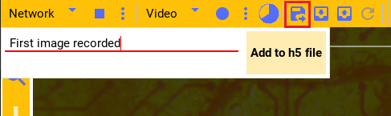

Ceed camera player
==================

A core function of Ceed is to stimulate the tissue broadly until it fluoresces,
and then visually locate cells and further stimulate them. Ceed comes with
built-in camera playing support using the same GUI components as the
`Filers2 <https://matham.github.io/filers2/index.html>`_ project.

Like Filers2, Ceed supports playing from a
`Webcam/video file <https://matham.github.io/filers2/guide/player_types.html#webcam-or-video-file-stream>`_,
a remote `server <https://matham.github.io/filers2/guide/player_types.html#network>`_,
`Thor camera <https://matham.github.io/filers2/guide/player_types.html#thor>`_, and from a
`PointGray camera <https://matham.github.io/filers2/guide/player_types.html#pointgray>`_. The typical setup
for Ceed is to control the camera externally through Filers2 and have Filers2 stream the images over the network
acting as a server. Then, Ceed streams the images from the server acting as a client displaying them in
the GUI. This is also described in this guide.

The above workflow is required because while Ceed is displaying a stage on the projector,
we cannot preview images, so we preview the camera on another (Windows) computer,
See also :ref:`ceed-blueprint`.

Filers2 side
------------

To stream images to Ceed using Filers2, install it and then start the Filers2 GUI.
Ensure that at least one Player is added.

Playing Thor camera
^^^^^^^^^^^^^^^^^^^

From the player menu select Thor. You can access its settings from the three dots, or
pin the settings for live interaction.

Refresh the list of cameras, select a camera serial number and then open it. You can
now play the camera from the play button and change its exposure, color filters,
and other settings.

You'll need to open camera every time after you close it before you can play the camera.

.. video:: ../media/guide/filers_play_thor.webm

Streaming to Ceed
^^^^^^^^^^^^^^^^^

Ensure that Jumbo packet is enabled as described :ref:`here <win-filers>`.
Then, in the recorder dropdown, select **server**. In its options enter the IP of this
computer. It cannot be localhost, but must be the actual IP (on Windows you can get it from
``ipconfig``).

Next, select a port, it can be pretty much any high number that is not already in use.
The number of queued frames is the maximum number of frames to buffer before dropping
newer frames. Finally start the server.

With the player playing and the server started, press the record button to stream. It will show
a timer of how long it has been recording. Press again to stop.

.. video:: ../media/guide/filers_record_server.webm

Ceed side
---------

Streaming from Filers2
^^^^^^^^^^^^^^^^^^^^^^

Ensure that Jumbo packet is enabled as described :ref:`here <linux-network>`.
Then, in Ceed from the player dropdown select Network. In its settings enter the
IP of the computer serving the Filers2 images and the port number selected
and open the connection.

With the connection open you can play the images streamed from Filers2.

Similar to Filers2, you can also record video and images from the player
to disk, using the recorder dropdown (not shown in the video).

.. video:: ../media/guide/play_from_network.webm

Camera image
------------

Logging image
^^^^^^^^^^^^^

Whenever an experiment starts Ceed will save the current camera image, if any, with the
:ref:`experiment-data`. However, at any time the current camera image can be added to the
current data file along with notes.

Press the button highlighted in the image and the dialog will appear. You can write
notes which will be included with the image.

You can see all the images logged (as well as experiments) in the experiment log
window by pressing the highlighted button in the image.

.. image:: ../media/guide/image_log_window.png

To retrieve the image, see :ref:`ceed-analysis` for reading the data file.

Saving/loading image
^^^^^^^^^^^^^^^^^^^^

You can directly save the current camera image to disk (if there's one), or load a
image from disk and set it as the current background camera image by pressing one
of the highlighted buttons.

.. image:: ../media/guide/down_up_image.png

E.g. the current camera image is saved as
:download:`this image file. <../media/guide/saved_cam_file.jpg>`

.. _reload-last:

Reloading last experiment image
^^^^^^^^^^^^^^^^^^^^^^^^^^^^^^^

As shown in :ref:`align-cam-proj`, if the camera is running during an experiment,
Ceed will bookmark the last image just before the experiment is ended. This is
useful because when the experiment ends, the stimulation ends and the consequent
fluorescence changes.

Press the highlighted button to restore the current image to this last
experiment image.

.. image:: ../media/guide/reset_image.png
