.. _microscope-optics:

Microscope optics V2
====================

This guide shows the current specification for all the lensing in the
microscope.

It lists all the lenses used in the microscope as well as the exact positioning
for each of the lenses to achieve the desired projection and camera magnification.

For each lens choice it estimated the best value using screenshots generated by running
the :ref:`optics-app` with test values.

Specs
------

Here's a list of all the lenses used in the microscope.
All distances are from the center of the dichroic cube. The axis from projector to tissue
goes negative to positive. The axis from tissue to camera is also negative to
positive.

1.  Projector. **PROPixx projector**. Projected image is at 1.22 meters from projector (@67cm). **@-55cm**.
2.  L1. **AC508-075-A-ML**. f=75mm – 2”. **@-51cm**.
3.  L2. **AC508-080-A-ML**. f=80mm – 2”. **@-49cm**.
4.  **ND filter** ring.
5.  L3. **AC508-200-A-ML**. f=200mm – 2”. **@-27cm**.
6.  **Dichroic**.
7.  L4. Objective lens **@13cm** (center). There are two objectives to choose from, a 4x (the default -
    all computations below use this) and a 2x when we need larger area.

    * **Nikon Plan Fluor**. F=41.3mm. 4x/0.13, WD17.2.
    * **CFI Plan Apochromat Lambda**. F=mm. 2x/0.1, WD8.5.
8.  **Tissue**. **@17.1748cm**.
9.  L5. **AC508-150-A-ML**. f=150mm – 2”. **@7cm**.
10. Camera. **4070C-USB** **Thor cam**. Sensor plate **@21.4077cm**.

The measured tissue projected area with the 4x objective is approximately 4.24mm x 2.41mm.
For the 2x objective it's 8.36mm x 4.72mm. Computed magnification from the projector
to the tissue is **-0.0072** for the 4x objective.

The camera sensor has 2048x2048 pixels and each pixel is 7.4μm x 7.4μm. Sensor area
width and height is 15.1552mm. Computed magnification from the tissue to the camera is **-3.6403**.
This results in a computed field of view on the tissue of 4.16mm square.

|image0|

Figure 1 The microscope

|image1|

Figure 2 The microscope annotated

Projector to tissue light path
------------------------------

For the projector to tissue path, the axis goes from the projector
towards the tissue through the dichroic mirror. The center of the
dichroic is the zero point, and the projector is on the negative part of
the axis and the tissue is on the positive side.

Static Optical Analysis
^^^^^^^^^^^^^^^^^^^^^^^

Following is the details of all the optical components in the
projector path.

.. _static-p-l1:

L1
""

L1 must sit close to the projector to get the full projector view and most
of the light. The “object” input to the lens is projected by the projector.
The “object” is between 1.22m to 10m on the right of the projector, depending
on the focal setting of the projector’s lens. Although it’s the right of L1, we
use the provided “object” position. We assume it’s set at 1.22m.

|image2|

Figure 3 The characteristics of L1.

The figure is read as follows, we input the focal length of the lens,
the position of the lens and the object (as output by the projector).
The output is the estimated image position (on the other side of the
lens, if positive relative to the lens), the magnification, and the
relative distance between the lens and the image.

.. _static-p-l2:

L2
""

L2 sits as close to L1 as possible and together they focus the image just to the right
of L2 and at a significant downscaling.

|image3|

Figure 4 The characteristics of L2.

.. _static-p-l3:

L3
""

L3 controls the zoom of the final projection on the tissue as well as the
distance from the objective lens to the projection. The goal is for that projection
to be at the rated working distance of the objective and to size the projection
to the required size.

This lens creates a virtual image at negative infinity. This collimates the light
before it reaches the objective.

|image4|

Figure 5 The characteristics of L3.

.. _static-p-l4:

L4
""

L4 is the final objective lens before the tissue. The position of the
lens is dictated by the positions of all the previous lenses and the
projector, given the objective's working distance. The projection should
be in focus at the working distance.

|image5|

Figure 6 The characteristics of L4.

Dynamic Optical Analysis
^^^^^^^^^^^^^^^^^^^^^^^^

In the following, we explore how the lens values were chosen and how the
lens values change the primary variables -- the final position of the
projected pattern and its magnification.

.. _dynamic-projector:

Projector
"""""""""

The projector is placed as close to the tissue as possible, given the lenses
in the path, so that we can capture all the light from the projector and the full
view. The projector has inbuilt lenses that diverge the light at a smallish angle as
it's coming out from the projector.

.. _dynamic-p-l1-l2:

L1-L2
"""""

Lens L1 and L2 are the smallest focal length lens at 2" diameter that
we can get. Its purpose is to scale down the image as much as possible.
The lenses are placed as close to each other as possible. The resultant
image should be focused just to the right of L2, as can be seen on a
piece of paper.

.. _dynamic-p-l3:

L3 Dynamic
""""""""""

The purpose of L3 is to provide some further down-scaling of the image.
It also collimates the light by forming a virtual image at negative
infinity. Light collimation is required for the objective to function
optimally.

The exact placement of the lens and its distance from the objective
(L4) determines how much down-scaling occurs. It also controls the
distance between the objective and the focused image, which ideally
will be the working distance of the objective to fully benefit from
the objective.

Assuming some placement of L4 (additionally investigated below),
we have two variables to control; the location and focal length
of L3. The following images investigate these variables.

|image7|

Figure 7 The final image magnification on the tissue in response
to L3 position and focal length. The red square is the selected
values for the microscope.

The desired value is 0.005 - 0.01. From the contours we see that
increasing the focal length decreases the magnification at this
position, with larger "jumps" at larger focal values. However,
moving the lens by small values keeps the magnification constant.

|image8|

Figure 8 The distance between the objective center and the final
projected image on the tissue in response to L3 position and focal
length. The red square is the selected values for the microscope.

The desired value is around 4.17cm because that seems to be the value
that focuses the image at the objective working distance of 1.72cm
from the objective end for the 4x and 8.5 for the 2x.

From the contours we see that increasing the focal length increases the distance.
So increasing the focal length also requires moving the L3 to the right
to maintain the working distance. Additionally, moving L3 too close to the
dichroic may cut off some light.

The final lens picked for L3 and its position optimizes all these variables.

.. _dynamic-p-l4:

L4 Dynamic
""""""""""

The purpose of L4, the objective is to focus the light on the tissue and
compensate for any optical defects in earlier stages. The final image
must be at its working distance.

|image9|

Figure 9 The final image magnification on the tissue in response
to L3 and L4 position. The red square is the selected
values for the microscope.

The desired value is 0.005 - 0.01. From the contours we see that
moving L3 changes the magnification, but moving L4 mostly does not.

|image10|

Figure 10 The distance between the objective center and the final
projected image on the tissue in response to L3 and L4 position.
The red square is the selected values for the microscope.

The desired value is around 4.17cm because that seems to be the value
that focuses the image at the objective working distance of 1.72cm
from the objective end for the 4x and 8.5 for the 2x.

From the contours we see that moving L3 changes the distance, but moving
L4 mostly does not. So given a specific focal length for L3, its exact
position must be fixed to get the appropriate distance.

Tissue to camera light path
---------------------------

For the tissue to camera path, the axis goes from the tissue towards the
camera through the dichroic mirror. The center of the dichroic is the
zero point, and the tissue is on the negative part of the axis and the
camera is on the positive side.

Static Camera Optical Analysis
^^^^^^^^^^^^^^^^^^^^^^^^^^^^^^

Following is the details of all the optical components in the
camera path.

.. _static-cam-l4:

L4 Camera
"""""""""

The position of L4 (objective lens) and the tissue location are
predetermined by the projector light path and the tissue location
as determined above.

|image11|

Figure 11 The characteristics of L4 relative to the camera path.

.. _static-cam-l5:

L5
""

L5 is the zoom lens between the camera and the objective. Its function is
to focus the image on the camera sensor plane and to zoom into the tissue
to see the full projected area.

It is chosen so that it doesn't waste too much resolution capturing
tissue outside the area of interest, but also so that the camera is
as close to the lens as possible.

|image12|

Figure 12 The characteristics of L5.

Dynamic Camera Optical Analysis
^^^^^^^^^^^^^^^^^^^^^^^^^^^^^^^

In the following, we explore how the lens values were chosen and how the
lens values change the primary variables -- the final position of the
image and therefore camera position and its magnification. In all of
this, we were looking for an ideal magnification around 3.5x (based on
experimental tests). Another limitation is that the distance between the final
lens (L7) and the image cannot be much less than 5cm or 6cm because the
lens and camera thickness prevent that. Also, there are physical limitations
on how close L5 can be to L4 because of the dichroic in the path.

.. _dynamic-cam-l4:

L4 Dynamic camera
"""""""""""""""""

The position and characteristics of L4 is determined by the projector
path.

.. _dynamic-cam-l5:

L5 Dynamic
""""""""""

The purpose of L5 is to focus the image on the camera.

The exact placement of the lens and its focal length determines the zoom.
It also controls the distance between the lens and the focused image, where
the camera's sensor needs to be placed.

|image13|

Figure 13 The final image magnification on the camera in response
to L5 position and focal length. The red square is the selected
values for the microscope.

The desired value is around 3.5. From the contours we see that
increasing the focal length increases the magnification. However,
moving the lens mostly keeps the magnification constant.

|image14|

Figure 14 The position of the final focused image (where the camera is placed)
in response to L5 position and focal length. The red square is the selected
values for the microscope.

The desired value is larger than about 5cm to accommodate the hardware. We also
don't want it to be too large.

From the contours we see that increasing the focal length linearly moves
the focused image position. Similarly, moving the lens up, also linearly
moves the focused image up.

The final lens picked and its exact position was selected to optimize the zoom
and visible area of interest of the tissue.

Projector power
---------------

We measured the projector power of the blue LED as it reaches the slice
through the dichroic using dichroic mirror that reflects blue to the tissue.

We varied the current using the Ceed software from 0A to 43A, the maximum.
We also varied the color intensity from 1 (255) to 0.5 (127) using the parameters
of the constant function in Ceed. We set the full projector area to output
blue.

Following is a table of the measured power in mW at the tissue plane using a
Thor PM100D with the S175C sensor. The first 4 columns was measured using the 4X,
objective lens while the last two columns is from the 2X objective.

+--------------+--------------+----------------+-----------------+------------------+-------------------+--------------------+
| Current (A)  | Intensity=1  | Intensity=0.5  | Intensity=0.25  | *Intensity=0.25  | 2X (Intensity=1)  | *2X (Intensity=1)  |
+==============+==============+================+=================+==================+===================+====================+
| 0            | 0.00         | 0.00           | -0.01           | -0.01            | 0.02              | 0.02               |
+--------------+--------------+----------------+-----------------+------------------+-------------------+--------------------+
| 1            | 0.50         | 0.37           | 0.11            | 0.09             | 0.93              | 0.85               |
+--------------+--------------+----------------+-----------------+------------------+-------------------+--------------------+
| 2            | 1.18         | 0.63           | 0.32            | 0.27             | 2.51              | 2.28               |
+--------------+--------------+----------------+-----------------+------------------+-------------------+--------------------+
| 3            | 1.86         | 0.92           | 0.59            | 0.49             | 3.98              | 3.62               |
+--------------+--------------+----------------+-----------------+------------------+-------------------+--------------------+
| 5            | 3.07         | 1.50           | 0.96            | 0.80             | 6.57              | 5.98               |
+--------------+--------------+----------------+-----------------+------------------+-------------------+--------------------+
| 10           | 5.71         | 2.77           | 1.72            | 1.43             | 12.25             | 11.15              |
+--------------+--------------+----------------+-----------------+------------------+-------------------+--------------------+
| 15           | 7.93         | 3.87           | 2.38            | 1.99             | 17.04             | 15.51              |
+--------------+--------------+----------------+-----------------+------------------+-------------------+--------------------+
| 20           | 9.87         | 4.90           | 3.02            | 2.53             | 21.08             | 19.18              |
+--------------+--------------+----------------+-----------------+------------------+-------------------+--------------------+
| 25           | 11.55        | 5.67           | 3.51            | 2.93             | 24.88             | 22.64              |
+--------------+--------------+----------------+-----------------+------------------+-------------------+--------------------+
| 30           | 13.03        | 6.44           | 3.87            | 3.23             | 28.07             | 25.55              |
+--------------+--------------+----------------+-----------------+------------------+-------------------+--------------------+
| 35           | 14.41        | 7.10           | 4.24            | 3.55             | 30.96             | 28.18              |
+--------------+--------------+----------------+-----------------+------------------+-------------------+--------------------+
| 40           | 15.61        | 7.60           | 4.61            | 3.86             | 33.41             | 30.41              |
+--------------+--------------+----------------+-----------------+------------------+-------------------+--------------------+
| 43           | 16.18        | 7.94           | 4.77            | 3.99             | 34.70             | 31.58              |
+--------------+--------------+----------------+-----------------+------------------+-------------------+--------------------+

The star indicates that the column data is conditioned. The 4X 0.25 intensity and 2X data was measured on a second
day than the 4X 1.0 and 0.5 intensity data. The sensor gained an offset of about 3.12 mW
on the second day as measured at full 1.0 intensity at 43A. The starred columns, are adjusted proportionally
to compensate.

Using the data, above **3A**, the best formula for the power at a particular current, intensity, and objective is::

    mW = (-0.0047*I^2 + 0.5682*I + 0.3438) * intensity * K

where

* ``I`` is the current,
* ``intensity`` is the intensity value between ``0-1`` set in a Ceed function, and
* ``K`` is ``1`` for the 4X objective and ``1.95`` for the 2X objective.

The power at low intensity (below 0.25) was not measured, but given the projector design it's expected to hold.

The power when the current is below about **3A** did not scale according to a clear function, so it is recommended to
not set the current below **3A** (except to zero).

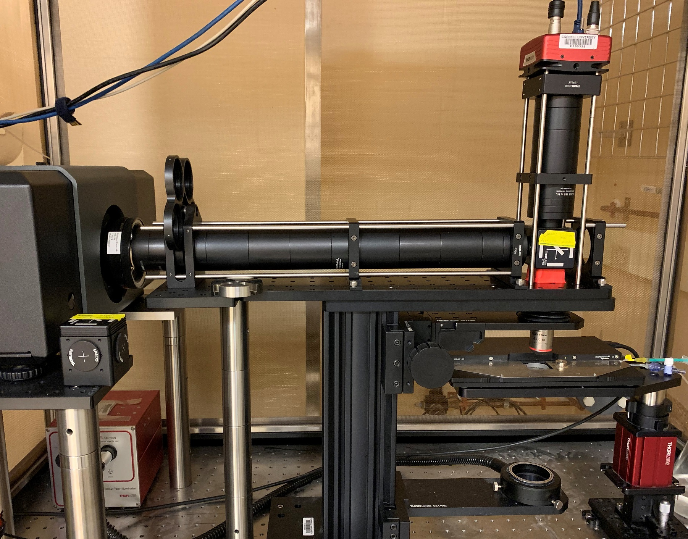
.. |image1| image:: media/Microscope_annotated_drawio.svg
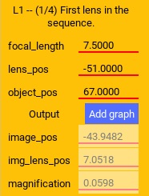
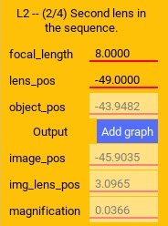
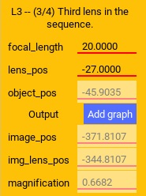
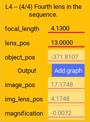
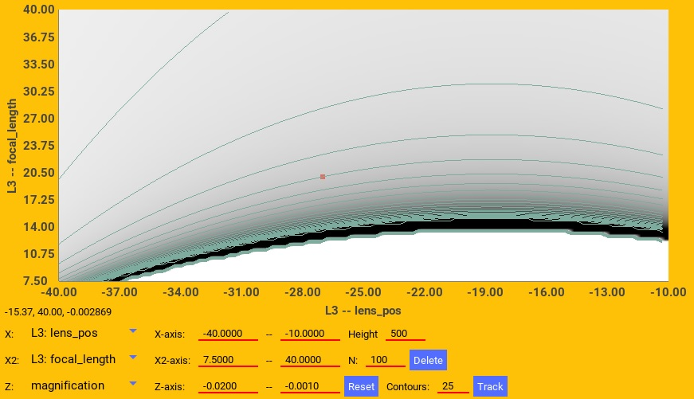
.. |image8| image:: media/L3_pos_vs_L3_f_dist_proj.jpg
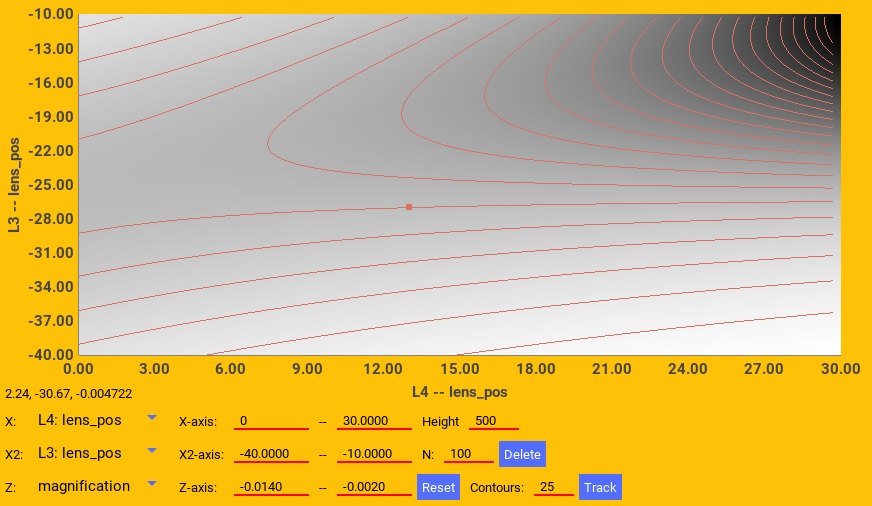
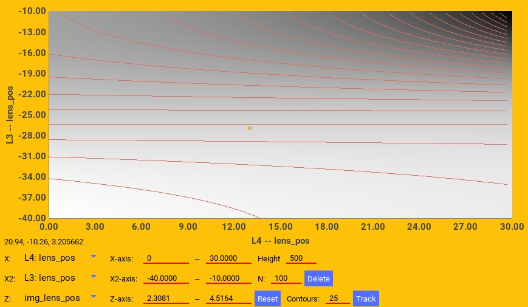
.. |image11| image:: media/L4_cam.jpg
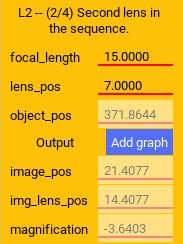
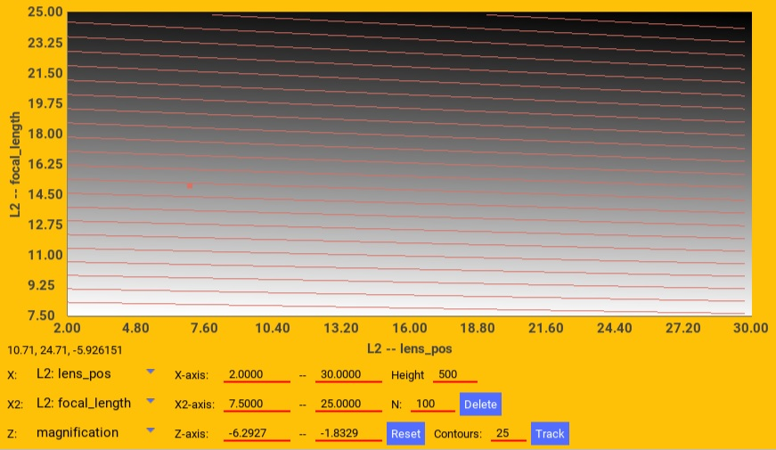
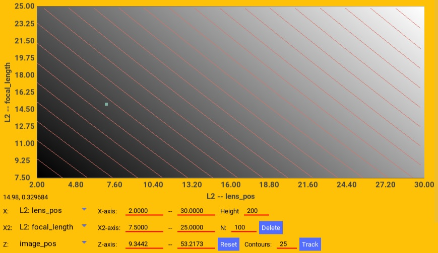
